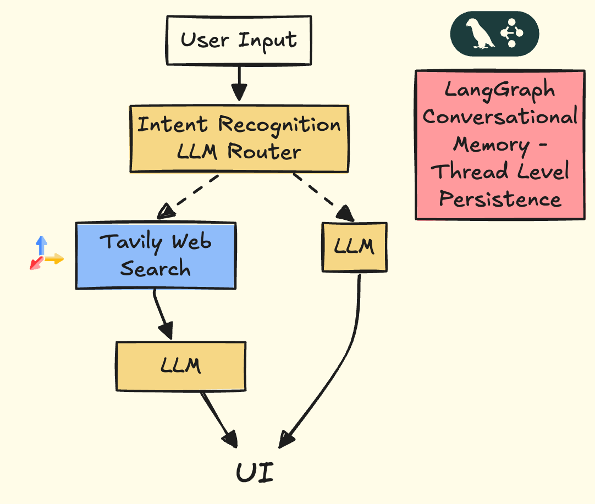

# Tavily Chatbot Example

<div align="center">
  
</div>

## 👋 Welcome to the Tavily Chatbot Repository!

This repository provides a simple yet powerful example of building a conversational chatbot with real-time web access, leveraging Tavily's advanced search capabilities. It intelligently routes queries between its base knowledge and live Tavily web searches, ensuring accurate, up-to-date responses.

Designed for ease of customization, you can extend this core implementation to:
- Integrate proprietary data
- Modify the chatbot architecture
- Modify LLMs

Tavily empowers developers to easily create custom chatbots and agents that seamlessly interact with web content.

## Features

- 🔍 Intelligent question routing between base knowledge and web search
- 🧠 Conversational memory with LangGraph
- 🌐 Real-time web search capabilities powered by Tavily
- 🚀 FastAPI backend with async support
- 🔄 Streaming of Agentic Substeps
- 💬 Markdown support in chat responses
- 🔗 Citations for web search results

## Architecture Diagram


## 📂 Repository Structure

This repository includes everything required to create a functional chatbot with web access:

### 📡 Backend ([`backend/`](./backend))
The core backend logic, powered by LangGraph:
- [`chatbot.py`](./backend/chatbot.py) – Defines the chatbot architecture, state management, and processing nodes.
- [`prompts.py`](./backend/prompts.py) – Contains customizable prompt templates.
- [`utils.py`](./backend/utils.py) – Utilities for parsing and managing conversation messages.

### 🌐 Frontend ([`ui/`](./ui))
Interactive React frontend for dynamic user interactions and chatbot responses.

### Server
- [`app.py`](./app.py) – FastAPI server that handles API endpoints and streaming responses.

---

## Setup Instructions

#### Set up environment variables:

   a. Create a `.env` file in the root directory with:
   ```bash
   TAVILY_API_KEY="your-tavily-api-key"
   OPENAI_API_KEY="your-openai-api-key"
   VITE_APP_URL=http://localhost:5173
   ```

   b. Create a `.env` file in the `ui` directory with:
   ```bash
   VITE_BACKEND_URL=http://localhost:8080
   ```

### Backend Setup
#### Python Virtual Environment
1. Create a virtual environment and activate it:
```bash
python3 -m venv venv
source venv/bin/activate  # On Windows: .\venv\Scripts\activate
```

2. Install dependencies:
```bash
python3 -m pip install -r requirements.txt
```

3. From the root of the project, run the backend server:
```bash
python app.py
```
#### Docker 

1. Alternatively, build and run the backend using Docker from the root of the project:
```bash
# Build the Docker image
docker build -t chat-tavily .

# Run the container
docker run -p 8080:8080 --env-file .env chat-tavily
```


### Frontend Setup

1. Navigate to the frontend directory:
```bash
cd ui
```

2. Install dependencies:
```bash
npm install
```

3. Start the development server:
```bash
npm run dev
```


## API Endpoints

- `POST /stream_agent`: Chat endpoint that handles streamed LangGraph execution

## Contributing

Feel free to submit issues and enhancement requests!

## 📞 Contact Us

Have questions, feedback, or looking to build something custom? We'd love to hear from you!

- Email our team directly:
  - [Dean Sacoransky](mailto:deansa@tavily.com)
  - [Michael Griff](mailto:michaelgriff@tavily.com)

---

<div align="center">
  
  <p>Powered by <a href="https://tavily.com">Tavily</a> - The web API Built for AI Agents</p>
</div>
